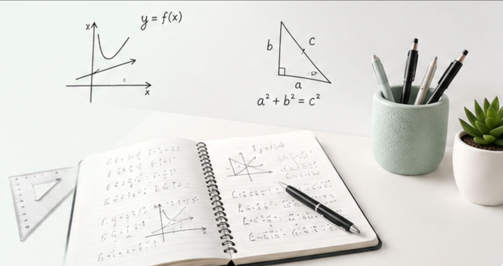

---
hide:
  - navigation
  - toc
---

<section class="maths-brand">
  

    
Mathématiques

    <h1>Seconde générale</h1>
    
Un espace de travail pour retrouver les cours, s'entraîner régulièrement et progresser tout au long de l'année.

  

</section>

<section class="maths-hero">
  

    <h2>Comprendre, s'entraîner, progresser.</h2>
    
Bienvenue sur le site de mathématiques du lycée Franklin. Vous y retrouverez les documents de cours, les TD, les automatismes et les ressources utiles pour préparer les évaluations.

    

      <a class="maths-button" href="#acces-rapide">🚀 Commencer à travailler</a>
      <a class="maths-link-button" href="progression/">Voir la progression →</a>
    

  

  

    
  

</section>

<section class="maths-cards">
  <a class="maths-card maths-card--blue" href="#acces-rapide">
    

      📘
      <h3>Cours</h3>
    

    
Retrouver les définitions, propriétés et exemples essentiels de chaque notion.

    →
  </a>
  <a class="maths-card maths-card--green" href="td/">
    

      📝
      <h3>TD</h3>
    

    
S'entraîner avec les exercices donnés en classe ou à la maison.

    →
  </a>
  <a class="maths-card maths-card--yellow" href="automatismes/">
    

      ⚡
      <h3>Automatismes</h3>
    

    
Travailler régulièrement les techniques rapides à maîtriser.

    →
  </a>
  <a class="maths-card maths-card--purple" href="progression/">
    

      🎯
      <h3>Progression</h3>
    

    
Suivre les notions de l'année et les échéances importantes.

    →
  </a>
</section>

<section class="maths-footer-row">
  

    📅
    

      <strong>À ne pas manquer.</strong> 
      Les ressources sont mises à jour progressivement. En cas d'absence, commencez par consulter la notion travaillée, puis récupérez le cours et le TD associés.
    

  

  

    <blockquote>
      « Les mathématiques ne sont pas une question de talent, mais de méthode et de persévérance. »
      <cite>— Claire Voisin</cite>
    </blockquote>
    💡
  

</section>

Lycée Franklin — Académie de Rennes · Mathématiques · Année scolaire 2026-2027

## Accès rapide

<!--
Les liens vers les notions de l'année sont ajoutés ou complétés par les scripts de publication.
Ne pas supprimer le titre "## Accès rapide" : il sert de point d'ancrage aux scripts.
-->

- [N01 — Logique ensembles](notions/N01-logique-ensembles.md)
- [N02 — Nombres reels intervalles](notions/N02-nombres-reels-intervalles.md)
- [N03 — Arithmetique](notions/N03-arithmetique.md)
- [N04 — Calcul litteral](notions/N04-calcul-litteral.md)
- [N05 — Équations inéquations](notions/N05-equations-inequations.md)
- [N06 — Synthese nombres calculs](notions/N06-synthese-nombres-calculs.md)
- [N07 — Vecteurs du plan](notions/N07-vecteurs-du-plan.md)
- [N08 — Droites équations](notions/N08-droites-equations.md)
- [N09 — Fonctions registres](notions/N09-fonctions-registres.md)
- [N10 — Fonctions affines](notions/N10-fonctions-affines.md)
- [N11 — Fonctions reference](notions/N11-fonctions-reference.md)
- [N12 — Variations extremums](notions/N12-variations-extremums.md)
- [N13 — Équations inéquations fonctions](notions/N13-equations-inequations-fonctions.md)
- [N14 — Synthese fonctions modelisation](notions/N14-synthese-fonctions-modelisation.md)
- [N15 — Géométrie plane problèmes](notions/N15-geometrie-plane-problemes.md)
- [N16 — Information chiffree statistiques](notions/N16-information-chiffree-statistiques.md)
- [N17 — Croisement variables qualitatives](notions/N17-croisement-variables-qualitatives.md)
- [N18 — Probabilités echantillonnage](notions/N18-probabilites-echantillonnage.md)
- [N19 — Synthese statistiques probabilités](notions/N19-synthese-statistiques-probabilites.md)
- [N20 — Synthese annuelle transition premiere](notions/N20-synthese-annuelle-transition-premiere.md)
