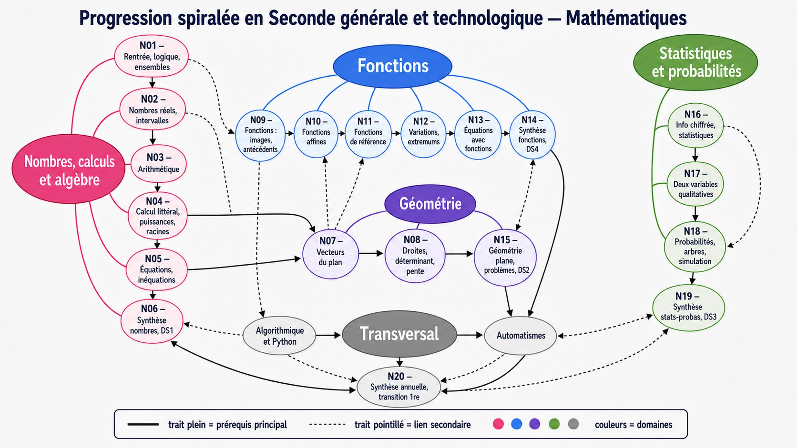

# Progression visuelle

Cette page présentera la carte des notions de Seconde mathématiques.

L'objectif est de montrer :

- le numéro de chaque notion ;
- son titre ;
- les liens entre les notions ;
- les dépendances importantes.

## Carte de progression

